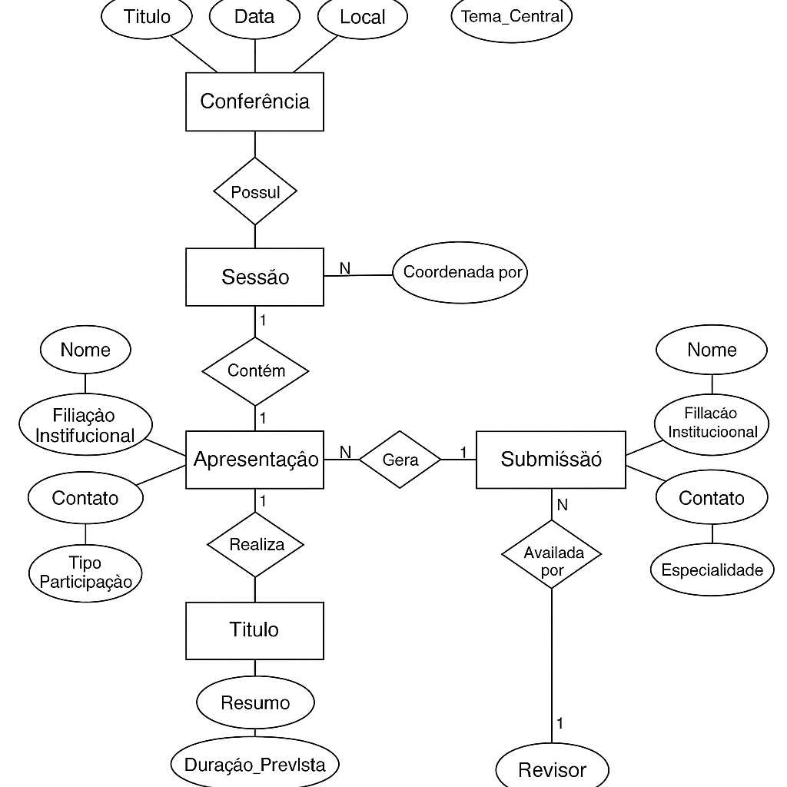

# 🗓️ Modelo Conceitual para Sistema de Gerenciamento de Conferências Científicas

## Introdução

Nós, da **Data Smart**, somos especialistas em modelagem de dados e fomos contratados para desenvolver um modelo conceitual para um sistema que gerencia conferências científicas. Este sistema deve ser capaz de gerenciar informações sobre conferências, participantes, sessões de apresentação, artigos submetidos e revisores.

## Levantamento de Requisitos

Para desenvolver um sistema eficiente de gerenciamento de conferências científicas, é necessário entender e capturar diversos aspectos de como as conferências são organizadas, quais são os participantes envolvidos e quais atividades ocorrem. As informações levantadas são as seguintes:

- **📅 Conferência**:
  - Cada conferência possui um título único, data de realização, local e um tema central.
  - As conferências podem ser compostas por várias sessões temáticas diferentes.

- **👤 Participante**:
  - Um participante pode ser um palestrante, ouvinte registrado ou organizador.
  - Cada participante possui dados pessoais como nome, filiação institucional, contato e tipo de participação no evento.

- **🗣️ Sessão**:
  - Cada sessão dentro de uma conferência aborda subtemas específicos do tema central.
  - Uma sessão inclui data e hora da apresentação, múltiplas apresentações e é coordenada por um ou mais organizadores.

- **🎤 Apresentação**:
  - Cada apresentação tem um título, um resumo, duração prevista e é atribuída a um palestrante específico.
  - Apresentações podem incluir também materiais de suporte, como slides ou vídeos.

- **📄 Submissão**:
  - Artigos ou resumos são submetidos por palestrantes para avaliação antes de serem aceitos para apresentação.
  - Cada submissão precisa ter informações dos artigos ou resumos, como título, resumo, data e status.
  - Cada uma das submissões é avaliada por revisores designados.

- **🔍 Revisor**:
  - Revisores são especialistas em tópicos específicos e são responsáveis por avaliar as submissões.
  - Eles fornecem feedback e uma decisão de aceitação ou rejeição.

## Etapa 1: Identificação das Entidades

Com base no levantamento de requisitos fornecido, as principais entidades que podemos identificar são:

1. **🗓️ Conferência**
2. **👤 Participante**
3. **🗣️ Sessão**
4. **🎤 Apresentação**
5. **📄 Submissão**
6. **🔍 Revisor**

## Gráfico de Entidades

📌 Modelo ER (Conceitual) completo  

## Conclusão

O modelo conceitual desenvolvido servirá como plano inicial para o desenvolvimento do modelo lógico que posteriormente será a base para podermos desenvolver uma implementação para um sistema de gerenciamento de conferências científicas, garantindo que todas as informações relevantes sejam capturadas e gerenciadas de forma eficiente. A próxima etapa envolverá a definição dos relacionamentos entre essas entidades e a criação do modelo lógico.

📌 Diagrama ER (Lógico) completo  

## 🎓 Sistema de Gerenciamento de Conferências Científicas

Com base nos diagrmas de ER Conceitual e Lógico, conseguimos desenvolver uma aplicação completa para organização, submissão e avaliação de eventos científicos, construída com Python, Flet e MySQL Workbench.

## 📌 Visão Geral
Este sistema foi desenvolvido para facilitar a administração de conferências científicas, permitindo o cadastro e gerenciamento de conferências, sessões temáticas, participantes, apresentações, submissões de artigos e avaliações por revisores.

A aplicação conta com uma interface gráfica moderna feita em Flet e integração completa com banco de dados MySQL, utilizando o MySQL Workbench para modelagem e administração do banco.

## 🧠 Funcionalidades Principais

📅 Cadastro e edição de Conferências

👥 Gerenciamento de Participantes (palestrantes, ouvintes e organizadores)

🗓️ Sessões com subtemas e horários definidos

🧾 Submissão e avaliação de trabalhos científicos

🗂️ Relacionamento completo entre Apresentações, Sessões e Conferências

🧑‍🔬 Avaliações por Revisores com feedback e decisões

💻 Interface em Flet para gerenciamento visual dos dados

## 🧱 Modelo de Dados
O sistema segue uma modelagem estruturada e normalizada com as seguintes entidades principais:

 - Conferência

 - Sessão

 - Participante

 - Apresentação

 - Submissão

 - Revisor

 - Avaliação

## 🛠️ Tecnologias Utilizadas

Tecnologia	Descrição

🐍 Python	Lógica da aplicação

🎨 Flet	Framework para UI nativa com Python

🐬 MySQL	Banco de dados relacional principal

🛠️ MySQL Workbench	Ferramenta para modelagem e gerenciamento

📝 SQL	Script de criação e inserção de dados

🧰 Visual Paradigm	Modelagem conceitual e lógica

🧰 Instalação do MySQL Workbench

## 🔧 Passos para Instalar
Acesse: https://dev.mysql.com/downloads/workbench/

Selecione o sistema operacional (Windows, macOS, Linux)

Siga as instruções de instalação e configure a conexão com o banco local ou remoto

📸 Veja abaixo as imagens de referência com os passos de conexão e execução do script.

## 🏗️ Criação do Banco de Dados
Para criar as tabelas e popular o banco de dados:

Abra o MySQL Workbench e clique no símbolo de "+" ao lado da opção "MySQL Connections". Preencha os dados conforme imagem abaixo:

📌 Imagem ilustrativa  
[

nossa configuração está assim: 

 - Connection Name: conferencia_cientifica
 - hostname: 127.0.0.1
 - Username: root
 - Password: 1234

   Após configurar estes campos clique no botão: Test Conection. Você deverá receber a seguinte mensagem conforme imagem abaixo

   📌 Imagem ilustrativa  
[

Clique em ok na janela que se abriu,  e em ok novmanete na janela "Setup New Connection". Haverá uma conexão chamada "conferencia_cientifica". Dê dois cliques sobre ela para acessarmos o servidor conforme imagem abaixo

    📌 Imagem ilustrativa  
[ 

Conecte-se ao seu servidor MySQL

Execute o conteúdo do arquivo /data/populacao_inicial.sql

Esse script irá:

Criar o banco ConferenciaCientifica

Criar todas as tabelas com relacionamentos

Inserir registros iniciais para testes

## 📂 Estrutura do Projeto

conferencia_sistem/

├── crud/

│   ├── conferencia_crud.py

│   ├── participante_crud.py

│   └── ...

├── ui/

│   ├── home.py

│   ├── participantes_view.py

│   └── ...

├── db/

│   └── conexao.py

├── data/

│   └── populacao_inicial.sql

├── docs/

│   ├── ERD_visualizacao.png

│   └── mysql_screenshots/

├── main.py

└── README.md

⚙️ Como Executar

✅ Pré-requisitos
Python 3.10+

MySQL Server instalado

MySQL Workbench (opcional, mas recomendado)

VSCode (recomendado)

🚀 Passo a passo

# Clone o projeto
git clone https://github.com/seuusuario/conferencia-sistema.git
cd conferencia-sistema

# Crie e ative o ambiente virtual
python -m venv venv
source venv/bin/activate  # Linux/macOS
venv\Scripts\activate     # Windows

# Instale as dependências
pip install -r requirements.txt

# Execute o script de criação de banco
mysql -u usuario -p < data/populacao_inicial.sql

# Inicie o sistema
python main.py

👨‍💻 Autor
Desenvolvido por Luiz André de Souza
📫 GitHub: @brodyandre

📄 Licença
Distribuído sob a licença MIT.
Veja LICENSE para mais informações.
